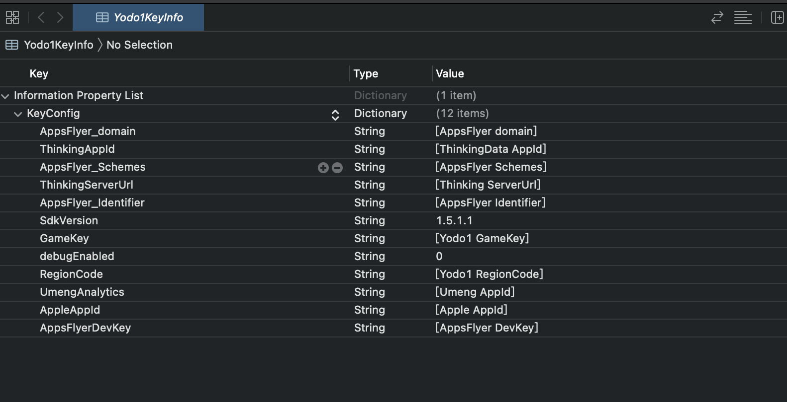
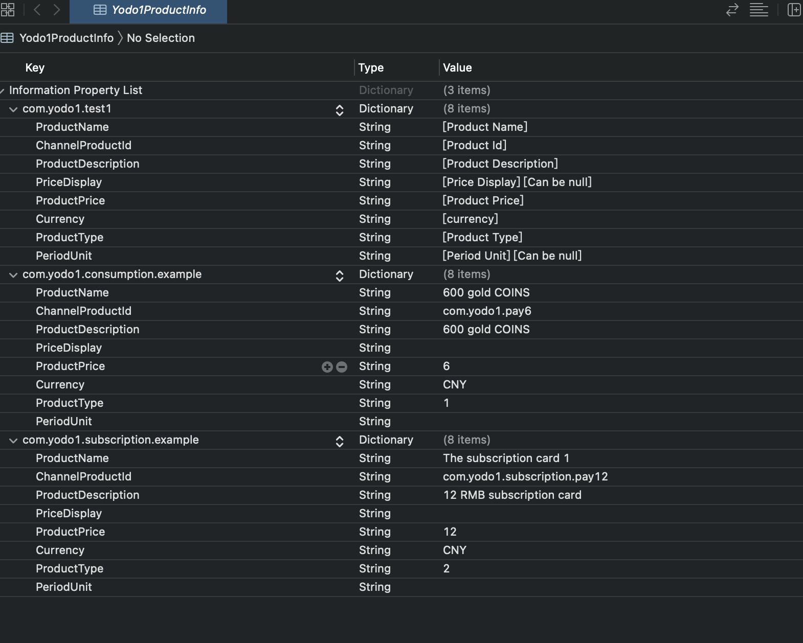

# iOS Integration

**Basic requirements**:
>* `iOS14` requires `Xcode` version to be `12+`, Upgrade `Xcode` version to `12+`.
>*  `SDK` requires the minimum version of `iOS` to be `iOS10.0`
>*  The easiest way is to use `CocoaPods` (Use `1.10` and above), Refer `CocoaPods` [official documentation](https://guides.cocoapods.org/using/using -cocoapods), for learning how to create and use a `Podfile`

## Integration steps
### 1. Add `iOS SDK` to the project
#### 1.1 Create `Podfile` file</br>
Create a `Podfile` file in the project root directory
```ruby
touch Podfile
```

#### 1.2 Import the iOS SDK into the project</br>
Open the project's `Podfile` file and add the following code to the application's target:

```ruby
source 'https://github.com/Yodo1Games/Yodo1Spec.git'
source 'https://github.com/CocoaPods/Specs.git'

pod 'Yodo1Suit/Yodo1_ConfigKey', '1.5.1.4'
pod 'Yodo1Suit/OpenSuit_AnalyticsAppsFlyer', '1.5.1.4'
pod 'Yodo1Suit/Yodo1_UCenter', '1.5.1.4'
```

Execute the following command in `Terminal`:</br>
```ruby
pod install --repo-update
```

### 2. `Xcode` project configuration
#### 2.1 Set `Info.plist` parameter
``` xml
<key>AnalyticsInfo</key> 
<dict>  
    	<key>ThinkingAppId</key> 
    	<string>[ThinkingData AppId]</string> 
    	<key>AppleAppId</key> 
    	<string>[Apple AppId]</string> 
    	<key>AppsFlyerDevKey</key> 
    	<string>[AppsFlyer DevKey]</string> 
</dict>
```

#### 2.2 Set `iOS9 App Transport Security`
In `iOS9`, Apple added controls on `ATS`. To ensure uninterrupted support of statistics on all intermediary networks, add the following settings in the `Info.plist` file:

* Add `NSAppTransportSecurity` of type `Dictionary`
* Add `NSAllowsArbitraryLoads` in `NSAppTransportSecurity`, type `Boolean`, value `YES`

The plist source code can also be edited(`Open As Source Code`) to achieve the same functionality; the example is as follows:
        
``` xml
<key>NSAppTransportSecurity</key> 
<dict> 
	<key>NSAppTransportSecurity</key> 
	<true/>
</dict>
```

#### 2.3 Disable `BitCode`
To ensure that all intermediary networks work properly, disable bitcode as shown in the image below:


### 3. Initialize The SDK
#### 3.1 Import the header file `Yodo1Manager.h `
``` obj-c
#import "Yodo1Manager.h"
```

#### 3.2 Add the code snippet below by using AppDelegate's `didFinishLaunchingWithOptions` method
``` obj-c
SDKConfig *config = [[SDKConfig alloc]init];
config.appKey = @"Your AppKey";
[Yodo1Manager initSDKWithConfig:config];
```

## Account Integration (Optional)

Import the header file `Yd1UCenter.h`

``` obj-c
#import "Yd1UCenter.h"
```
``` obj-c
[Yd1UCenter.shared deviceLoginWithPlayerId:@"" callback:^(YD1User * _Nullable user, NSError * _Nullable error) {
}];
```

## In-App Purchase Integration

### 1. Requirements

You need to prepare the below `SHARED KEY` before you start integration In-App purchase integration, and send it to Yodo1 Team. The link https://appstoreconnect.apple.com/access/shared-secret


### 1. Set up the SKUs of game

 `Yodo1ProductInfo.plist`
 
``` xml
<key>custom name</key> 
<dict> 
    	<key>ProductName</key> 
    	<string>product name</string> 
    	<key>ChannelProductId</key> 
    	<string>product id</string> 
    	<key>ProductDescription</key> 
    	<string>product description</string> 
    	<key>PriceDisplay</key> 
    	<string>displayed price</string> 
    	<key>ProductPrice</key> 
    	<string>product price</string> 
    	<key>Currency</key> 
    	<string>currency</string> 
    	<key>ProductType</key> 
    	<string>1(0:not consumable, 1:consumable, 2:auto subscribe, 3:non-auto subscription)</string> 
    	<key>PeriodUnit</key> 
    	<string>Period Unit</string> 
</dict>
```


The product structure is as follows
	
| Key                 | Data Type | Description |
| ------------------- | --------- | ----------- |
| ProductName         |   string  | Product Name|
| ChannelProductId    |   string  | Product unique ID |
| ProductDescription  |   string  | Product description |
| PriceDisplay        |   string  | Displayed price |
| ProductPrice        |   string  | Product Price(CNY:元,USD:dollar) |
| Currency            |   string  | Currency type(eg:USD,CNY,JPY,EUR,HKD) |
| ProductType         |   string  | 1(0:not consumable, 1:consumable, 2:auto subscribe, 3:non-auto subscription) |
| PeriodUnit          |   string  | Period Unit |
	
### 2. Import the header file `Yd1UCenterManager.h``Yd1UCenter.h`
``` obj-c
#import "Yd1UCenterManager.h"
#import "Yd1UCenter.h"
```
### 3 Purchase product
``` obj-c
/**
 * Buy product
 * extra is a dictionary json string @{@"channelUserid":@""} (optional)
 */
- (void)paymentWithUniformProductId:(NSString *)uniformProductId
                              extra:(NSString*)extra
                           callback:(PaymentCallback)callback;
```
### 4. Restore purchased products
```obj-c
/**
 *  Restore purchases
 */
- (void)restorePayment:(RestoreCallback)callback;
```
### 5. Query missing orders

```obj-c
/**
 *  Query missing orders
 */
- (void)queryLossOrder:(LossOrderCallback)callback;
```
### 6. Query subscription
<font color=red>Important: </font>The API for querying and subscribing products is checked with the Apple API. The number of requests per day is limited. In order to ensure that this function can be used normally, make reasonable arrangements to call the API for querying and subscribing.

```obj-c
/**
 *  Query subscription
 */
- (void)querySubscriptions:(BOOL)excludeOldTransactions
                  callback:(QuerySubscriptionCallback)callback;
```
### 7. Query products information

```obj-c
/**
 *  Get information about a product
 */
- (void)productWithUniformProductId:(NSString*)uniformProductId
                           callback:(ProductsInfoCallback)callback;
``` 
```obj-c                        
/**
 *  Get information on all products
 */
- (void)products:(ProductsInfoCallback)callback;
```
### 8. Send goods successfully
Send notification of purchase success to payment server of Yodo1, this method will be called when the item has been purchased and distributed to the player successfully.

```obj-c
/**
 *  Send Goods Success
 */
- (void)sendGoodsOver:(NSString *)orderIds
             callback:(void (^)(BOOL success,NSString* error))callback;
```
### 9. Send goods failed
Send notification of purchase failed to payment server of Yodo1, this method will be called when the item purchased has been failed.


```obj-c
/**
 *  Send Goods Failed
 */
- (void)sendGoodsOverForFault:(NSString *)orderIds
                     callback:(void (^)(BOOL success,NSString* error))callback;
```

## Analytics Integration
### 1. Import the header file `Yodo1AnalyticsManager.h`
``` obj-c
#import "Yodo1AnalyticsManager.h"
```
### 2. Report event
``` obj-c
/**
 *  @param eventName  event id (required)
 *  @param eventData  event data (optional)
 */
- (void)eventAnalytics:(NSString*)eventName
             eventData:(NSDictionary*)eventData;
```

### 3. AppsFlyer report events

``` obj-c
/**
 *  Custom events with appsflyer
 *  @param eventName  event id (required)
 *  @param eventData  event data (optional)
 */
- (void)eventAdAnalyticsWithName:(NSString *)eventName 
                       eventData:(NSDictionary *)eventData;
```
