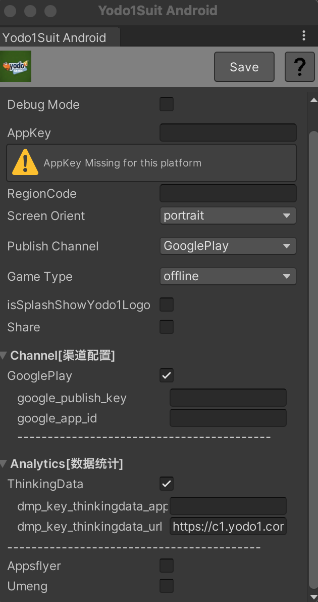
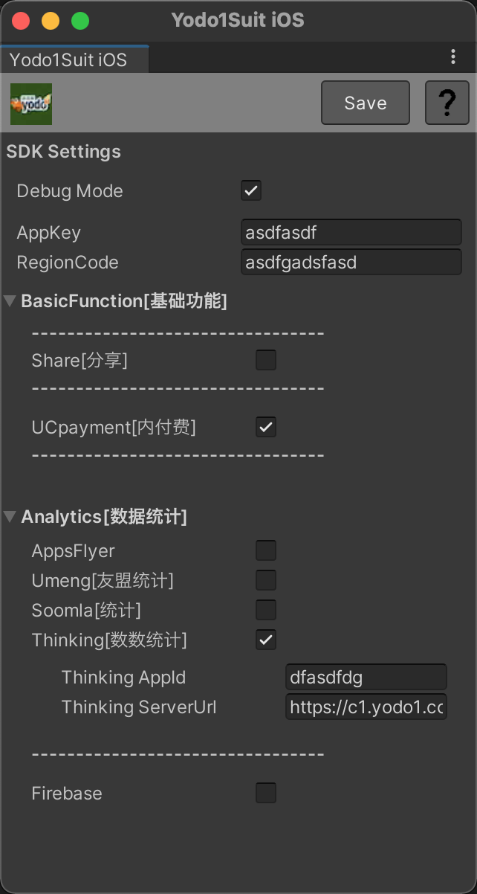
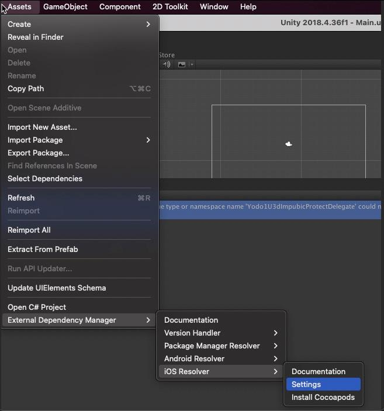

# Unity Suit

**集成准备**:
>* 下载[Unity插件](https://bj-ali-opp-sdk-update.oss-cn-beijing.aliyuncs.com/Yodo1Sdk_OpenSuit/Yodo1SDK(Suit)-6.1.1.unitypackage)
>* SDK支持Unity LTS 版本（2019或更高版本）
>* SDK支持Android API 19+
>* `CocoaPods`是`iOS`构建所必需的，可以按照[这里](https://guides.cocoapods.org/using/getting-started.html#getting-started)的说明安装。
>* iOS14需要`Xcode` 12+，请确保你的`Xcode`是最新的。


## 集成步骤
### 1. 集成配置
### 1.1 进行Android配置
<center class="half">
    
</center>

>* AppKey配置Yodo1 GameKey，RegionCode配置Yodo1 RegionCode（没有可以不用配置）
>* 如果使share功能，请勾选`Share`，同时配置对应的appkey和link
>* 如果使用渠道支付功能，请勾选`GooglePlay`
>* 数据统计ThinkingData必须配置，请配置ThinkingData appid
>* 其他数据统计是可选的，如果需要请勾选，配置对应的配置信息（AppsFlyer附加了deeplink功能，不使用可以不配置）
>* Debug Mode为日志打开和测试模式开启，上线时请关闭

[Jetifier](https://developer.android.com/jetpack/androidx/releases/jetifier)是Android构建所必需的，可以通过选择 ***Assets > External Dependency Manager > Android Resolver > Settings > Use Jetifier*** 启用

<center class="half">
    
</center>

AndroidManifest配置(针对需要定制启动)-使用unitypackage中自带的plugin/AndroidManifest.xml可以不用配置
/Assets/Plugins/Android/AndroidManifest.xml 修改application：

```java	
android:name="com.yodo1.android.sdk.Yodo1Application"
```
修改启动类

```java	
<!-- YODO1 SDK(Use PA System) Start -->
        <!-- 闪屏页,游戏必须配置com.yodo1.android.sdk.view.SplashActivity,其他配置游戏可自己定制，SplashActivity必须为应用启动组件,其screenOrientation属性，尽量根据游戏配置sensorLandscape/sensorPortrait“-->
        <activity android:name="com.yodo1.android.sdk.view.SplashActivity"
            android:hardwareAccelerated="true"
            android:launchMode="singleTop"
android:exported="true"
            android:screenOrientation="portrait">
            <intent-filter>
                <action android:name="android.intent.action.MAIN"/>
                <category android:name="android.intent.category.LAUNCHER"/>
            </intent-filter>
        </activity>

         <!-- 闪屏页的跳转目标 -->
         <meta-data
            android:name="YODO1_MAIN_CLASS"
            android:value="com.yodo1.plugin.u3d.Yodo1UnityActivity"/>

        <activity
            android:name="com.yodo1.plugin.u3d.Yodo1UnityActivity"
            android:label="@string/app_name"
            android:screenOrientation="user"
android:exported="false"
            android:launchMode="singleTask"
android:configChanges="mcc|mnc|locale|touchscreen|keyboard|keyboardHidden|navigation|orientation|screenLayout|uiMode|screenSize|smallestScreenSize|fontScale">
            <meta-data android:name="unityplayer.SkipPermissionsDialog" android:value="true" />
     <meta-data android:name="unityplayer.UnityActivity" android:value="true" />
</activity>
<!-- YODO1 SDK(Use PA System) End -->
```

### 1.2 进行iOS settings配置
<center class="half">
    
</center>

>* AppKey配置Yodo1 GameKey，RegionCode配置Yodo1 RegionCode（没有可以不用配置）
>* 如果使share功能，请勾选`Share`，同时配置对应的appkey和link
>* 如果使用支付功能，请勾选`UCpayment`
>* 如果使用iCloud功能，请勾选`iCloud`
>* 数据统计ThinkingData必须配置，请配置ThinkingData appid
>* 其他数据统计是可选的，如果需要请勾选，配置对应的配置信息（AppsFlyer附加了deeplink功能，不使用可以不配置。配置好后，需要在XCode中检查domain配置）
>* Debug Mode为日志打开和测试模式开启，上线时请关闭

<center class="half">
    
    
</center>

>* use_framework必须添加

### 2. 集成接入
### 2.1 初始化
```java	
//Your App Key 是yodo1分配的gameKey
Yodo1U3dSDK.InitWithAppKey("Your App Key");
//or
Yodo1U3dSDK.InitWithAppKey("Your App Key","RegionCode");
//or
//Your Config是json，格式如{"appKey":"asdb","regionCode":"asdfb","appsflyerCustomUserID":"1243"}
//无登录游戏，务必传appsflyerCustomUserID
Yodo1U3dSDK.InitWithConfig("Your Config");
```

### 2.2 统计功能
#### 2.2.1 发送自定义事件
注意，很多特定统计是空实现，使用需要咨询。可尽可能使用自定义统计接口。

``` java
/**
 * 自定义事件上报,eg: [Guide_Frist_Jump, {"default":"1"}]
 *
 * @param event
 * @param jsonData eventParameters
 */
Yodo1U3dAnalytics.customEvent()
```
#### 2.2.2 用户相关-特定事件
``` obj-c
//统计平台的用户登录。游戏自定义玩家属性值，来配置填充到统计sdk上。eg.accountId(clientId,user,playId)
Yodo1U3dAnalytics.login(Yodo1U3dUser user);

//Google Play支付校验。如果使用sdk内GooglePlay支付，则不需要手动调用。
Yodo1U3dAnalytics.validateInAppPurchase_GooglePlay(String publicKey, String signature, String purchaseData, String price, String currency);
//AppleStore支付校验
Yodo1U3dAnalytics.validateInAppPurchase_Apple(string productId, string price, string currency, string transactionId);
//以自定义事件进行支付上报
Yodo1U3dAnalytics.eventAndValidateInAppPurchase_Apple(string revenue, string currency, string quantity, string contentId, string receiptId);
```
#### 2.2.3 特定渠道事件统计
说明：当游戏应用不执行suit内置登录时，请使用initWithConfig进行初始化，并设置appsflyerCustomUserID值为用户或者设备唯一id。（可以获取使用deviceId）

``` java
Yodo1U3dAnalytics.customEventAppsflyer();
```
### 2.3 账号功能
#### 2.3.1 登录
``` java
Yodo1U3dAccount.Login();
/**
  *loginType:缺省代表渠道登录
  *Channel(0, "支付渠道账号登陆", "Channel"),,默认使用Channel方式登录
  *Device(1, "设备登陆", "Device"),
  *Google(2, "谷歌账号登陆", "Google"),
  *Yodo1(3, "游道易账号登录", "Yodo1"),
  *Wechat(4, "微信登录", "WECHAT"),
  *Sina(5, "新浪微博登录", "SINA"),
  *QQ(6, "QQ登录", "QQ");
  *extra      一般传null，有时有特殊配置
**/
Yodo1U3dAccount.Login(Yodo1U3dConstants.LoginType loginType, string extra)
```
设置登录回调：

``` java
//设置回调
Yodo1U3dAccount.SetLoginDelegate(LoginDelegate);
void LoginDelegate(Yodo1U3dConstants.AccountEvent accountEvent, Yodo1U3dUser user){
    if (accountEvent == Yodo1U3dConstants.AccountEvent.Success) {
Debug.Log ("login success");
    } else if (accountEvent == Yodo1U3dConstants.AccountEvent.Fail) {
Debug.Log ("login failed");
}
}
```

#### 2.3.2 提交用户信息
登录成功后，游戏根据自己的逻辑处理上报给sdk和渠道sdk，设置玩家playerId，和其他信息。健壮后面的逻辑。

``` java
Yodo1U3dAccount.SubmitUser (Yodo1U3dUser);
```
Yodo1U3dUser结构：

| Key名称            | 描述 | 是否为空|
| -------------- | --------- | ----- |
| playedId       |   用户id   | 不可为空|
| nickName       |   用户昵称  | 可为空|
| level          |   等级     | 可为空|
| age            |   年龄     | 可为空|
| gender         |   性别     | 可为空|
| gameServerId   |   服务器id | 可为空|

#### 2.3.3 登出（紧支持Andriod）
退出登录，在切换登录等特定需要时接入。一般不接入。

``` java
Yodo1U3dAccount.Logout ();
//设置回调：Yodo1U3dAccount.SetLogoutDelegate(LogoutDelegate);
void LogoutDelegate (Yodo1U3dConstants.AccountEvent accountEvent) {
         Debug.Log ("----LogoutDelegate--- accountEvent: " + accountEvent);
     }
```

#### 2.3.4 判断是否已经登录
退出登录，在切换登录等特定需要时接入。一般不接入。

``` java
bool isLogin = Yodo1U3dAccount.IsLogin ();
```

### 2.4 支付IAP功能
在开始集成之前，您需要准备以下`共享密钥`，并将其发送给Yodo1团队。
<font color=red>Apple Pay要求: </font>[Apple链接](https://appstoreconnect.apple.com/access/shared-secret)


<font color=red>Google Pay要求: </font>[Google链接](https://developers.google.com/android-publisher/authorization?hl=en)


#### 2.4.1 计费点配置和计费点托管
游戏内商品的iap 商品计费点，在项目中单独配置放置。大多数渠道包，通过打到包内的 xml 配置，获取商品最新的价格、名称、描述等信息。其中小米，华为，googlePlay等渠道，使用计费点托管到渠道服务器，根据对应的productId，来获取商品信息，或者发起支付。

这里提供一个excel模板。[点击打开IapConfig_sample.xls](./../../resource/IapConfig_sample.xls)

接入方，收集统计游戏内所有的商品信息，填入excel表格中，上传反馈到 yodo1 系统即可。需要进行托管的计费点，由运营人员编辑各个渠道所需要的格式，上传开启。游戏开发一视同仁。

Suit Unity打包中，将excel表格改名为IapConfig，扩展名保持不变。放置于Yodo1/Suit/Resources/目录下。

产品结构如下：
	
| Key                 | Data Type | Description |
| ------------------- | --------- | ----------- |
| ProductName         |   string  | Product Name|
| ChannelProductId    |   string  | Product unique ID |
| ProductDescription  |   string  | Product description |
| PriceDisplay        |   string  | Displayed price |
| ProductPrice        |   string  | Product Price(CNY:元,USD:dollar) |
| Currency            |   string  | Currency type(eg:USD,CNY,JPY,EUR,HKD) |
| ProductType         |   string  | 1(0:not consumable, 1:consumable, 2:auto subscribe, 3:non-auto subscription) |
| PeriodUnit          |   string  | Period Unit |

#### 2.4.2 查询所有商品
一般在游戏实名认证结束后，或者登录成功后 进行，也可以在游戏大厅和在需要商品信息之前，请求获取到。

``` java
//该方法会请求所有商品信息，然后在回调中全部返回
Yodo1U3dPayment.RequestProductsInfo();
或
//该方法只会获取指定的商品的信息， 然后在回调中返回 string puoductID = "iap_few_coins";
Yodo1U3dPayment.ProductInfoWithProductId(puoductID);
    
设置回调：Yodo1U3dPayment.SetRequestProductsInfoDelegate (RequestProductsInfoDelegate);
    
void RequestProductsInfoDelegate(bool success, List<Yodo1U3dProductData> products){
     if (products != null) {
           foreach (Yodo1U3dProductData product in products) {
              Debug.Log ("productId:" + product.ProductId + ",PriceDisplay:" + product.PriceDisplay + ",PriceDisplay:" + product.PriceDisplay);
              Debug.Log ("MarketId:" + product.MarketId + ",Currency:" + product.Currency + "\n" + "Description" + product.Description + "\n");
           }
     }
}
```

#### 2.4.3 查询已经拥有的订阅型商品
一般在游戏实名认证结束,或者登录成功后进行，也可以在游戏大厅和在需要商品信息之前，请求获取到。备注：只适用于GooglePlay渠道，AppleStore渠道。

``` java
Yodo1U3dPayment.SetQuerySubscriptionsDelegate(QuerySubscriptionsDelegate);
  
Yodo1U3dPayment.QuerySubsriptions();
```

#### 2.4.4 查询已经拥有的消耗和非消耗商品
一般在游戏实名认证结束,或者登录成功后进行，也可以在游戏大厅和在需要商品信息之前，请求获取到。备注：只适用于GooglePlay渠道。

``` java
Yodo1U3dPayment.SetVerifyProductsInfoDelegate(VerifyPurchasesDelegate);
  
Yodo1U3dPayment.RequestGoogleCode();
```

#### 2.4.5 恢复所有商品
一般在游戏实名认证结束,或者登录成功后进行，也可以在游戏大厅和在需要商品信息之前，请求获取到。备注：只适用于GooglePlay渠道，AppleStore渠道。

``` java
Yodo1U3dPayment.SetRestorePurchasesDelegate(RestorePurchasesDelegate);
  
Yodo1U3dPayment.restorePurchase();
```

#### 2.4.6 支付
调用支付方法，对于需要用户登录才能拉起支付的时候会先自动调用登录。

``` java
/**该方法会根据引入的渠道展示支付方式（支付宝，微信，渠道，运营商）
* productId  商品Id
* extra 透传值，可为null
* 建议方式
**/i
Yodo1U3dPayment.Purchase(string productId, string extra)
```

设置支付回调：

``` java
Yodo1U3dPayment.SetPurchaseDelegate(PurchaseDelegate);
/**
* orderId,yodo1订单号
* channelOrderId , iOS订单号。（目前只在iOS中）
* productId，计费点文件的Id。
* extra，渠道支付返回的多余信息
* payType，支付类型
*/
void PurchaseDelegate (Yodo1U3dConstants.PayStatus status, string orderId, string productId, string extra, Yodo1U3dConstants.PayType payType)
{
        Debug.Log ("status : " + status + ",productId : "+productId+", orderId : "+orderId+ ", extra : " + extra);
if (status == Yodo1U3dConstants.PayStatus.PaySuccess) {
//支付成功
}
}
```
#### 2.4.7 查询漏单
一般在游戏实名认证结束,或者登录成功后进行，也可以在游戏大厅和在需要商品信息之前，请求获取到。
Yodo1U3dPayment.QueryLossOrder ();

设置回调：

``` java
Yodo1U3dPayment.SetLossOrderIdPurchasesDelegate(LossOrderIdPurchasesDelegate);
  
void LossOrderIdPurchasesDelegate(bool success, List<Yodo1U3dProductData> products) {
    if (success && products != null) {
        foreach (Yodo1U3dProductData product in products) { Debug.Log ("productId:" + product.ProductId + ",PriceDisplay:" + product.PriceDisplay + ",PriceDisplay:" +     product.PriceDisplay); Debug.Log ("MarketId:" + product.MarketId + ",Currency:" + product.Currency + "\n" + "Description" + product.Description + "\n");
      }
   }
}
```

#### 2.4.8 发货成功通知
 购买成功后，调用发货成功通知接口。。功能是健全购买流程，作为丢单的统计依据。

``` java
/**
 * 发送发货成功通知，可以不用在意回调处理。
 */
         Yodo1U3dPayment.sendGoods(orderId[]);
//可以不接入
  
         Yodo1U3dPayment.SetSendGoodsOverDelegate(SendGoodsOverDelegate);
```

#### 2.4.9 发货失败通知
 购买失败后，调用发货失败通知接口。。功能是健全购买流程，作为丢单的统计依据。

``` java
/**
 * 发送发货失败通知，可以不用在意回调处理。
 */
         Yodo1U3dPayment.sendGoodsFail(orderId[]);
//可以不接入
          Yodo1U3dPayment.SetSendGoodsFailDelegate(SendGoodsFailDelegate);
```

### 2.5  退出游戏
``` java
Yodo1U3dUtils.exit (this, exitCallback);
    
//退出游戏回调
void exitCallback(string msg){
     Debug.Log ("exitCallback, msg = " + msg);
}
```

### 3. 可选功能使用
### 3.1 在线参数功能
使用在线参数功能，设置在线参数的key/value需要与Yodo1团队沟通，然后进行设置
#### 3.1.1 激活码功能
yodo1 PA生成相关规则激活码。兑换码领奖品接口
Yodo1U3dUtils.VerifyActivationCode(“activation Code”);

设置回调：

```java	
/// <summary>
/// Verifies the activation code.
/// </summary>
/// <param name="activationCode">Activation code.</param>
Yodo1U3dUtils.VerifyActivationCode(“activation Code”);
  
/// <summary>
/// Set activity verify delegate
/// </summary>
/// <param name="activityVerifyDelegate"></param>
Yodo1U3dSDK.setActivityVerifyDelegate(ActivityVerifyDelegate);
  
void ActivityVerifyDelegate (Yodo1ActivationcodeData data) {
 Debug.Log ("reward:" + data.Rewards.ToString());
 foreach (string goodName in data.Rewards.Keys) {
 int value = 0;
 int.TryParse (data.Rewards [goodName].ToString (), out value);
 Debug.Log ("goodName:" + goodName + ", value:" + value);
 }
 Debug.Log ("rewardDes:" + data.RewardDes + ", errorMsg:" + data.ErrorMsg);
}
```

#### 3.1.2 获取在线参数，开发工具辅助类
``` java
/**
 * 获取在线参数，值的分发。方便进行云控制
 */
Yodo1U3dUtils.getConfigParameter();
Yodo1U3dUtils.StringParams();
Yodo1U3dUtils.BoolParams();
 
/**
 * 用以展示对话框。AlertDialog.
 */
Yodo1U3dUtils.showAlert(String title,String message,String positiveButton,String negativeButton,String neutralButton,String objectName,String callbackMethod)
/**
 * 存储数据到原生层。从原生层获取数据。
 */
Yodo1U3dUtils.SaveToNativeRuntime(key,value);
Yodo1U3dUtils.GetnativeRuntime(key);
```

### 3.2 分享功能
snsType为二进制数字：

``` java
Yodo1SNSTypeNone(-1),
Yodo1SNSTypeTencentQQ(1 << 0), //朋友圈
Yodo1SNSTypeWeixinMoments(1 << 1), //朋友圈
Yodo1SNSTypeWeixinContacts(1 << 2),//聊天界面
Yodo1SNSTypeSinaWeibo(1 << 3), //新浪微博
Yodo1SNSTypeFacebook(1 << 4), //Facebook
Yodo1SNSTypeTwitter(1 << 5), //Twitter
Yodo1SNSTypeInstagram(1 << 6), //Instagram
Yodo1SNSTypeAll(1 << 7); //所有平台分享
```
可以使用程序员计算机计算，或者手动位计算十进制：
所有平台 = 127或者128
Facebook + Twitter+ Instagram = 112
朋友圈，qq控件，微信聊天，微博 = 15

``` java
/**
*  分享
* 分享list一个则直接分享，多个则出现分享到列表对话框。
**/
Yodo1U3dUtils.share();
//设置分享结果回调
Yodo1U3dSDK.setShareDelegate(ShareDelegate);
```

### 3.3 打开web
``` java
/**
 * 打开app推荐界面，商店应用详情界面。
 */
Yodo1U3dUtils.openReviewPage();
/**
 * 开启应用内web页面
 */
Yodo1U3dUtils.openWebPage(String url, String valuePaireJson);
```

### 3.4 云存储功能/iCloud
``` java
Yodo1U3dPublish.saveToCloud（）
Yodo1U3dPublish.loadToCloud（）
 
//设置回调。googleCloud,iCloud.
Yodo1U3dSDK.setiCloudGetValueDelegate();
```

### 3.5 GameCenter功能
#### 3.5.1 成就功能/Achievement
``` java
// 打开成就
Yodo1U3dPublish.achievementsOpen();

// 解锁成就
Yodo1U3dPublish. achievementsUnlock(tring achievementStr);

// 更新成就分数
Yodo1U3dPublish.updateScore();
```

#### 3.5.2 排行榜功能/Leaderboard
``` java
Yodo1U3dPublish.leaderboardsOpen()；
```

### 3.6 社区功能/Community,MoreGame,BBS
``` java
/**
 * 打开游戏社区。调用之前，判断是否有该功能
 */
Yodo1U3dUtils.OpenCommunity ();
bool hasCommunity = Yodo1U3dUtils.HasCommunity ()
//一些国内渠道支持更多游戏，方便进行推广拉新。获取更高的推荐。
Yodo1U3dUtils.ShowMoreGame();
/**
 * 打开游戏论坛
 */
Yodo1GameUtils.openBBS();
/**
 * 打开渠道评论反馈界面
 */
Yodo1GameUtils.openFeedback();
```

### 3.7 录制屏幕功能
``` java
//开启录屏
Yodo1U3dPublish.BeginRecordVideo();
//停止录屏,仅支持iOS
Yodo1U3dPublish.StopRecordVideo();
//展示录屏,仅支持iOS
Yodo1U3dPublish.ShowRecordVideo();
//是否支持截屏
Yodo1U3dPublish.IsCaptureSupported();
```

### 3.8 打开/跳转 app评价页
``` java
Yodo1U3dUtils.openReviewPage();
```

### 3.9 获取设备id,SIM,国家码,语言，版本号等

``` java
/**
 * 获取设备id
 */
Yodo1U3dUtils.getDeviceId();
/**
 * 获取PlayId>uid>deviceId
 */
Yodo1U3dUtils.getUserId();
/**
 * 获取当前系统地区
 */
Yodo1U3dUtils.getCountryCode();
/**
 * 设置当前应用语言
 */
Yodo1U3dSDK.SetLocalLanguage();
/**
 * 获取设备的sim卡
 *
 * @return 无卡 : 0   cmcc : 1   ct : 2   cu : 4
 */
Yodo1U3dUtils.getSIM();
/**
 * 获取版本号
 */
Yodo1U3dUtils.getVersionName();
/**
 * 判断是否是中国大陆.ext为空。
 */
Yodo1U3dUtils.IsChineseMainland();
```

### 3.10 获取渠道号
``` java
/**
 * 获取当前渠道号。
 */
//Yodo1U3dUtils.getSdkcode();
/**
 * 获取发布渠道
 */
Yodo1U3dUtils.GetPublishChannelCode();
```

## Error Codes

### Account 

| ErrorCode | ErrorMessage                    |
| :-------- | :----------------------------   |
| 0         | ACCOUNT\_ERROR\_FAILED          |
| 1         | ACCOUNT\_CANCEL                 |
| 2         | ACCOUNT\_ERROR\_ACCOUNT\_ERROR  |
| 3         | ACCOUNT\_ERROR\_PLUGIN\_ERROR   |
| 4         | ACCOUNT\_ERROR\_NETWORK\_ERROR  |
| 11        | ACCOUNT\_ERROR\_OPS\_ERROR      |
| 12        | ACCOUNT\_ERROR\_NO\_LOGIN       |
| 13        | ACCOUNT\_ERROR\_NO\_PERMISSIONS |

### In-App Purchase

| ErrorCode | ErrorMessage                    |
| :-------- | :-------------------------------|
| 0         | ERROR\_CODE\_FAIELD             |
| 2         | ERROR\_CODE\_CANCEL             |
| 3         | ERROR\_CODE\_FAIELD\_VERIFY     |
| 205       | ERROR\_CODE\_USER\_ERROR        |
| 203       | ERROR\_CODE\_MISS\_ORDER        |
| 206       | ERROR\_CODE\_CREATE\_ORDER      |
| 207       | ERROR\_CODE\_NOT\_FIND\_LIBRARY |
| 209       | ERROR\_CODE\_NOT\_PERMISSSIONS  |