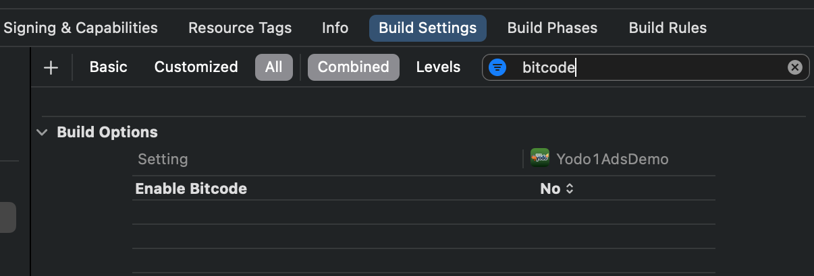

# ios_sdkinit_document

## 1.SDK初始化之前准备工作
1>pod init
podfile -> 引入source
source 'https://github.com/Yodo1Games/Yodo1Spec.git'
source 'https://github.com/Yodo1Sdk/Yodo1Spec.git'
source 'https://github.com/CocoaPods/Specs.git'

引入SDK
pod 'Yodo1Ads/OpenSuit_AnalyticsAppsFlyer'
pod 'Yodo1Ads/OpenSuit_AnalyticsUmeng'
pod 'Yodo1Ads/Yodo1_iCloud'
pod 'Yodo1Ads/Yodo1_UCenter'
pod 'Yodo1Ads/Yodo1_ConfigKey'
...

2>pod install(pod install --repo-update)

3>设置Yodo1KeyInfo.plist参数

4>设置bitcode=No

5>Other Linker Flags添加-ObjC，-lxml2

## 2.SDK初始化
1>引入头文件
# #import "Yodo1Ads.h"
# #import "YD1AgePrivacyManager.h"

2>SDK初始化
[Yodo1Ads initWithAppKey:@"Your AppKey"];

3>设置privacy
[Yodo1Ads setTagForUnderAgeOfConsent:<BOOL>];
[Yodo1Ads setUserConsent:<BOOL>];

4>log日志
[Yodo1Ads setLogEnable:<BOOL>];

5>展示年龄选择框
[YD1AgePrivacyManager dialogShowUserConsentWithGameAppKey:@"Your AppKey" channelCode:@"appstore" viewController:self block:^(BOOL accept, BOOL child, int age) {...}];

