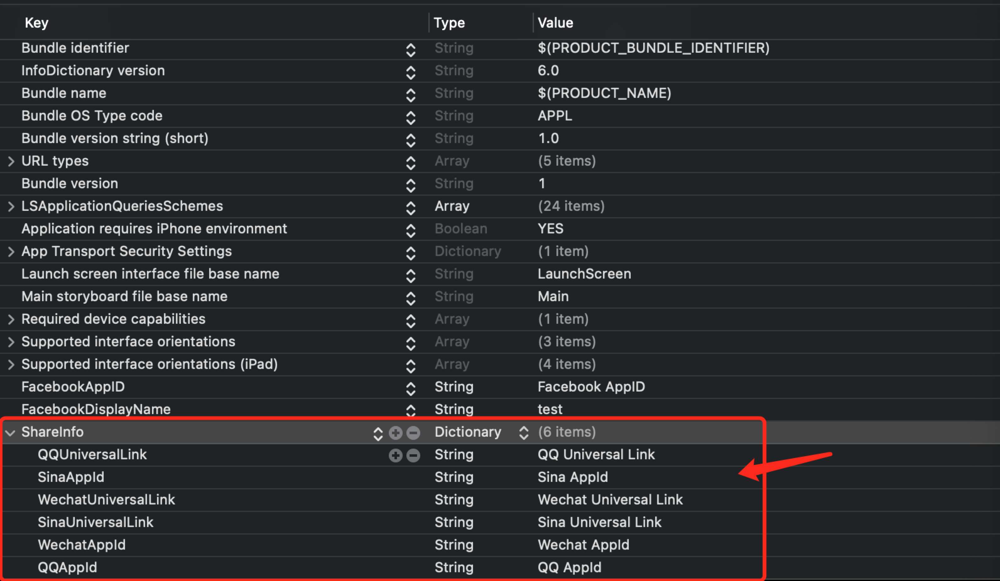

# iOS Share

**开始前**:
>* ' iOS14 '要求' Xcode '版本为' 12+ '，请确保升级你的' Xcode '版本为' 12+ '。
>* ' SDK '要求' iOS '的最低版本为' iOS10.0 '
>*最简单的方法是使用' CocoaPods '(请使用' 1.10 '及以上)，如果你是' CocoaPods '的新手，请参考它的[官方文档](https://guides.cocoapods.org/using/using -cocoapods)，学习如何创建和使用' Podfile '

## 集成步骤
### 1. 添加`iOS SDK`到项目中
#### 1.1 创建 `Podfile` 文件</br>
在项目的根目录中创建`Podfile`文件

```ruby
touch Podfile
```

#### 1.2 引入iOS SDK到项目中</br>
请打开项目中的`Podfile`文件并且将下面的代码添加到文件中:

```ruby
source 'https://github.com/Yodo1Games/Yodo1-Games-Spec.git'
source 'https://github.com/CocoaPods/Specs.git'

pod 'Yodo1Share', '6.1.1'
```

在`终端`中执行以下命令:</br>
```ruby
pod install --repo-update
```

### 2. `Xcode`项目配置
#### 2.1 需要在`Info.plist`中设置`LSApplicationQueriesSchemes`
* 添加 `LSApplicationQueriesSchemes ` 类型 `Array`

``` xml
<key>LSApplicationQueriesSchemes</key>
	<array>
		<string>fbauth2</string>
		<string>fb-messenger-share-api</string>
		<string>fbshareextension</string>
		<string>fbapi</string>
		<string>sinaweibo</string>
		<string>weibosdk</string>
		<string>weibosdk2.5</string>
		<string>weixin</string>
		<string>weixinULAPI</string>
		<string>mqqapi</string>
		<string>mqqopensdkapiV2</string>
		<string>mqq</string>
		<string>mttbrowser</string>
		<string>weibosdk3.3</string>
		<string>mqqOpensdkSSoLogin</string>
		<string>mqzone</string>
		<string>mqqopensdkapiV3</string>
		<string>mqqapiwallet</string>
		<string>mqqwpa</string>
		<string>mqqbrowser</string>
		<string>mqqopensdknopasteboard</string>
	</array>
```

#### 2.2 设置URL types


### 3. 初始化SDK
#### 3.1 引入头文件`Yodo1SNSManager.h`
``` obj-c
#import "Yodo1SNSManager.h"
```

#### 3.2 在项目中的AppDelegate的`didFinishLaunchingWithOptions` 方法中添加以下代码
初始化方法一

``` obj-c
[[Yodo1SNSManager sharedInstance]initSNSPlugn:nil];
```
设置`Info.plist` 参数

``` xml
<key>ShareInfo</key> 
<dict>  
    	<key>QQAppId</key> 
    	<string>[QQ AppdId]</string> 
    	<key>QQUniversalLink</key> 
    	<string>[QQ Universal Link]</string> 
    	<key>WechatAppId</key> 
    	<string>[Wechat AppId]</string>
    	<key>WechatUniversalLink</key> 
    	<string>[Wechat Universal Link]</string>
    	<key>SinaAppId</key> 
    	<string>[Sina AppId]</string> 
    	<key>SinaUniversalLink</key> 
    	<string>[Sina Universal Link]</string> 
</dict>
```

初始化方法二

``` obj-c
[[Yodo1SNSManager sharedInstance]initSNSPlugn:@{kYodo1QQAppId:@"QQ AppdId",
                                                    kYodo1QQUniversalLink:@"QQ Universal Link",
                                                    kYodo1WechatAppId:@"Wechat AppId",
                                                    kYodo1WechatUniversalLink:@"Wechat Universal Link",
                                                    kYodo1SinaWeiboUniversalLink:@"Sina Universal Link",
                                                    kYodo1SinaWeiboAppKey:@"Sina AppKey",
                                                    kYodo1FacebookAppId:@"Facebook AppId",
                                                    kYodo1FacebookDisplayName:@"Facebook Display Name"}];
```
<font color=red>特殊: </font>如果需要使用Facebook分享功能，需要在`Info.plist`单独配置

``` xml
<key>FacebookAppID</key> 
<string>[Facebook AppID]</string>
<key>FacebookDisplayName</key> 
<string>[Facebook DisplayName]</string>
```

### 4. 分享api使用
``` obj-c

@interface SMContent : NSObject
@property (nonatomic,assign) Yodo1SNSType snsType;  //平台分享类型
@property (nonatomic,strong) NSString *title;       //仅对qq和微信有效
@property (nonatomic,strong) NSString *desc;        //分享描述
@property (nonatomic,strong) UIImage *image;        //分享图片
@property (nonatomic,strong) NSString *url;         //分享URL
@property (nonatomic,strong) UIImage *qrLogo;       //二维码logo
@property (nonatomic,strong) NSString *qrText;      //二维码右边的文本
@property (nonatomic,assign) float qrTextX;         //文字X偏移量
@property (nonatomic,assign) float qrImageX;        //二维码偏移量
@property (nonatomic,strong) UIImage *gameLogo;    //Share App of Logo
@property (nonatomic,assign) float gameLogoX;      //sharelogoX偏移量

@end

// 调用分享
- (void)showSocial:(SMContent *)content
             block:(SNSShareCompletionBlock)completionBlock;
             
/**
 *  检查是否安装新浪，微信，QQ客户端,facebook 服务是否有效
 *
 *  @param snsType Yodo1SNSType
 *
 *  @return YES安装了客户端或服务有效 可以分享！
 */
- (BOOL)isInstalledWithType:(Yodo1SNSType)snsType;

```

在`delegate`方法openURL:sourceApplication:annotation:中添加如下代码：

``` obj-c

- (BOOL)application:(UIApplication *)application openURL:(NSURL *)url sourceApplication:(nullable NSString *)sourceApplication annotation:(id)annotation
{
    return [[Yodo1SNSManager sharedInstance]application:application openURL:url sourceApplication:sourceApplication annotation:annotation];
}

```
在`delegate`openURL:options:中添加如下代码：

``` obj-c
- (BOOL)application:(UIApplication *)application openURL:(NSURL *)url options:(NSDictionary<UIApplicationOpenURLOptionsKey, id> *)options
{
    return [[Yodo1SNSManager sharedInstance]application:application openURL:url options:options];
}

```